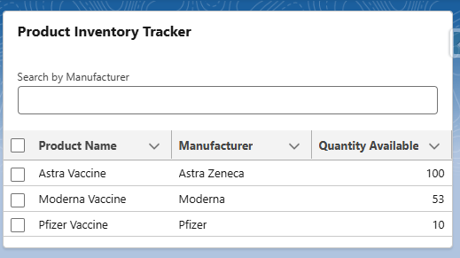

# Salesforce Vaccine Management App

A Salesforce-native solution to manage vaccination scheduling, inventory, patient records, and notifications.

## 🔧 Key Features
- Patient record management using custom objects
- LWC components for appointment booking and availability display
- Apex triggers for inventory management and dose tracking
- Flow automation for reminders and follow-ups
- Dashboards for vaccine stock levels and usage trends

## 🧪 Technologies Used
- Lightning Web Components (LWC)
- Apex Classes and Triggers
- Salesforce Flows
- Custom Metadata Types
- Reports & Dashboards

## 🖼️ Screenshots

### Lightning Web Component: Product Inventory


## 🚀 How to Deploy
1. Clone the repo:
   ```bash
   git clone https://github.com/AdrianneGeyer/vaccine-management-app.git
   cd vaccine-management-app